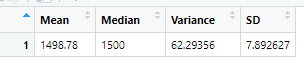
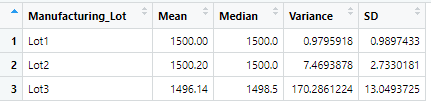
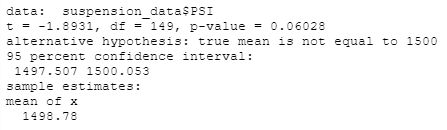
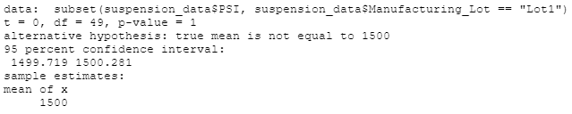
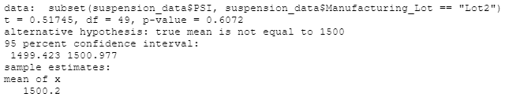
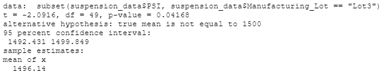

# MechaCar Statistical Analysis

## Linear Regression to Predict MPG
* The variables that provided a non-random amount of variance to the MPG included vehicle length and ground clearance.
* The slope of these variables are not zero.
* With a multiple R-squared=0.715, it seems to predict the mpg of the MechaCar prototypes effectively, but will likely not predict any new data added to the dataset.

## Summary Statistics on Suspension Coils
### Total Summary

* The overall variance accross the 3 lots does meet the design specification.
* When the lots are analyzed separately the, not all three meet the design specification.

### Lot Summary

* Lots 1 and 2 both pass the design specificaitons with variance  of 0.980 and 7.469 respectively.
* Lot 3 does not fall within the design specifications with a variance of 170.286.

## T-Tests on Suspension Coils
### Overall T-test Result

* Based on the p-value of this t-test, there is not significant evidence to reject the null hypotheisis. Thus, the overall mean of PSI accross the three lots is statistically similar to the 1500 psi of the popluation mean.

### Lot 1 T-test Result

* Based on the p-value of the t-test, the mean PSI of Lot 1 is statistically similar to the 1500 psi of the population mean.

### Lot 2 T-test Result

* Based on the p-value of the t-test, the mean PSI of Lot 1 is statistically similar to the 1500 psi of the population mean.

### Lot 3 T-test Result

* Based on the p-value of the t-test, the mean PSI of Lot 1 is statistically different to the 1500 psi of the population mean.

## Study Design: MechaCar vs Compitition
To compare how MechaCar performas against the Compitition, the overall mpg, safety rating, price, and maintenance costs could be used.